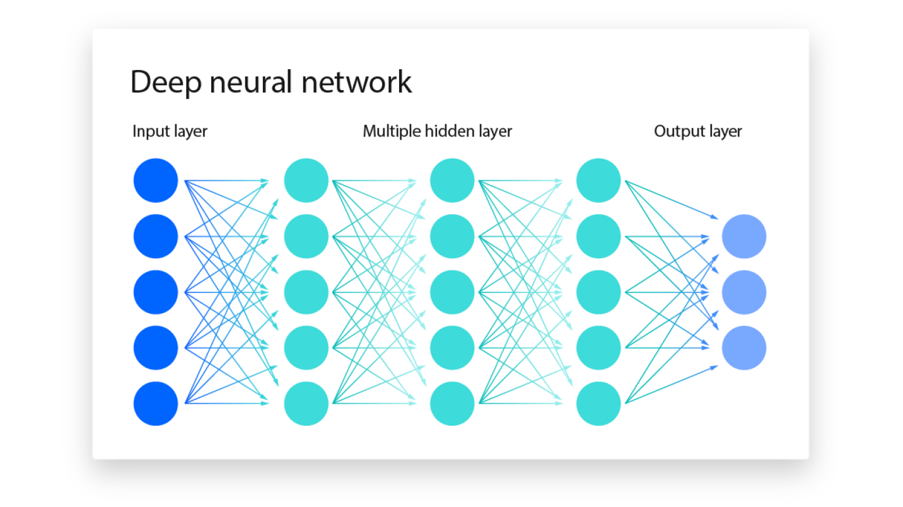

Deep learning is a subset of [[ai.ml]] that uses multilayered [[ai.ml.dl.neural-network]], called deep neural networks, to simulate
the complex decision-making power of the human brain.

Neural networks, or artificial neural networks, attempt to mimic the human brain through a combination of data inputs, weights and bias—all acting as silicon neurons. These elements work together to accurately recognize, classify and describe objects within the data.

Deep neural networks consist of multiple layers of interconnected nodes, each building on the previous layer to refine and optimize the prediction or categorization. This progression of computations through the network is called [[forward-propagation]]. The input and output layers of a deep neural network are called **visible layers**. The input layer is where the deep learning model ingests the data for processing, and the output layer is where the final prediction or classification is made.

Another process called [[backpropagation]] uses algorithms, such as [[gradient-descent]], to calculate errors in predictions, and then adjusts the weights and biases of the function by moving backwards through the layers to train the model. Together, forward propagation and backpropagation enable a neural network to make predictions and correct for any errors. Over time, the algorithm becomes gradually more accurate.

Deep learning requires a tremendous amount of computing power. High-performance [[gpu]] are ideal because they can handle a large volume of calculations in multiple cores with copious memory available. Distributed cloud computing might also assist. This level of computing power is necessary to train deep algorithms through deep learning. However, managing multiple GPUs on premises can create a large demand on internal resources and be incredibly costly to scale. For software requirements, most deep learning apps are coded with one of these three learning frameworks:

- [[jax]]
- [[python.pytorch]]
- [[python.tensorflow]]

## Types of Deep Learning Models

Deep learning algorithms are incredibly complex, and there are different types of neural networks to address specific problems or datasets. Each has its own advantages and they are presented here roughly in the order of their development, with each successive model adjusting to overcome a weakness in a previous model.

1. [[ai.ml.dl.cnn]]
2. [[ai.ml.dl.rnn]]

## Ressources

- [Full Stack deep learning](https://fullstackdeeplearning.com/)
- [L'apprentissage profon - Yann LeCun](https://www.youtube.com/watch?v=TdLa5h-x2nA&list=PLtimy8tnozIAUxCZZusJbu4xjjNxHYd0Y)
- [Deep Learning Specialization](https://www.deeplearning.ai/courses/deep-learning-specialization/)
- [DeepLearning.ai AI Notes](https://www.deeplearning.ai/ai-notes/index.html)
- [Practical Deep Learning for Coders](https://course.fast.ai/)
- [DS-GA 1008 · SPRING 2021 · NYU CENTER FOR DATA SCIENCE](https://atcold.github.io/NYU-DLSP21/)
- [Fast.ai : Practical Deep Learning for Coder](shttps://course.fast.ai/)

---

Deep learning took off in the 2010’s at the same time of social network, like Facebook, gathered speed. Now in the mid 2020’s, leaders in deep learning are the GAFAM whose built up on top of massive users’ data. The attention economy helps these tech companies snowball into what they are today. [@orlowskiSocialDilemma2020]
